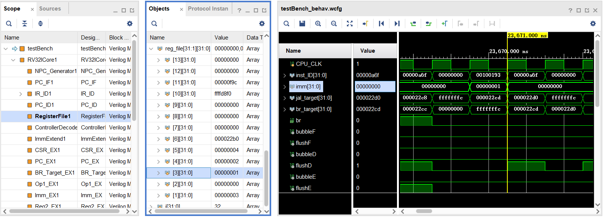

# RISC-V 32I CPU

## 文件结构

```
├─Figures           # 存放数据通路图
│   Design-Figure.drawio
│   Design-Figure.png
│
├─Simulation        # 存放仿真文件及测试数据
│   ...
│   testBench.v     # 仿真文件
│
├─Source            # CPU源代码
│  ├─Cache          # 数据和指令cache
│  ├─CSR            # CSR有关部件
│  ├─ExMemSegReg    # 级间寄存器
│  ├─IdExSegReg
│  ├─IfIdSegReg
│  └─MemWbSegReg
│    ALU.v          
│    BranchDecision.v
│    ControllerDecoder.v
│    DataExtend.v
│    GeneralRegister.v
│    Hazard.v
│    ImmExtend.v
│    NPCGenerator.v
│    Parameters.v
│    PC.v
│    RV32ICore.v
│
└─TestTools         #测试数据生成工具
    ├─ExampleCode   #示例代码
    └─Utils         #转换工具
```

## CPU基本情况

本仓库实现了一个基于`RISC-V 32I`指令集的五段流水线`CPU`, 支持的指令有:

```
SLLI、SRLI、SRAI、ADD、SUB、SLL、SLT、SLTU、XOR、SRL、SRA、OR、AND、ADDI、SLTI、SLTIU、XORI、ORI、ANDI、

LUI、AUIPC、JALR、JAL、

LB、LH、LW、LBU、LHU、

SB、SH、SW、

BEQ、BNE、BLT、BLTU、BGE、BGEU、

CSRRW、CSRRS、CSRRC、CSRRWI、CSRRSI、CSRRCI
```

`RISC-V 32I`的指令类型定义如下:

<div align=center>

</div>
</br>

`CPU`的[数据通路](./Figures/Design-Figure.png)如下:

<div align=center>

</div>
</br>

## 仿真

以`Vivado`开发为例, 新建工程, 将[Source](./Source)的代码导入, Simulation文件夹下的[testBench.v](./Simulation/testBench.v)作为仿真文件导入, 并将`testBench.v`设置为Simulation的Top文件。之后直接进行仿真即可, 仿真文件会自动将`.inst`和`.data`的文件加载进`Instruction Cache`和`Data Cache`, 并开始执行。

示例如下图所示:

<div align=center>

</div>
</br>

对于测试样例, 若运行正确, 则`gp`为`1`.

`testBench.v`定义了四个宏: 

- **DataCacheContentLoadPath**: `Data Cache`的写入文件路径
- **InstCacheContentLoadPath**: `Instruction Cache`的写入文件路径
- **DataCacheContentSavePath**: `Data Cache`导出内容的存放路径
- **InstCacheContentSavePath**: `Instruction Cache`导出内容的存放路径
  
请根据需要自行修改。

[TestTools](./TestTools/)文件夹内包含`.inst`和`.data`文件转换工具, 使用说明见文件夹内的[README文档](./TestTools/README.md)。