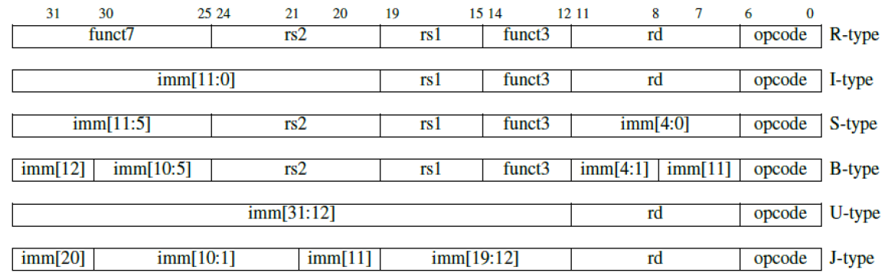

# RISC-V 32I CPU

## 文件结构

```
├─Figures               # 存放数据通路图
│   Design-Figure.drawio
│   Design-Figure.png
│
├─Simulation        
│   testBench.v         # 仿真文件
│
├─Source                # CPU源代码
│  ├─Cache              # 数据和指令cache
│  ├─CSR                # CSR有关部件
│  ├─ExMemSegReg        # EX-MEM级间寄存器
│  ├─IdExSegReg         # ID-EX级间寄存器
│  ├─IfIdSegReg         # IF-ID级间寄存器
│  └─MemWbSegReg        # MEM-WB级间寄存器
│    ALU.v          
│    BranchDecision.v
│    ControllerDecoder.v
│    DataExtend.v
│    GeneralRegister.v
│    Hazard.v
│    ImmExtend.v
│    NPCGenerator.v
│    Parameters.v       # 参数文件
│    PC.v
│    RV32ICore.v        # CPU顶层文件
│
└─TestTools             #测试数据生成工具
    ├─FunctionalTest    #功能测试
    └─PerformanceTest   #性能测试
```

## CPU基本情况

本仓库实现了一个基于`RISC-V 32I`指令集的五段流水线`CPU`, 支持的指令有:

```
SLLI、SRLI、SRAI、ADD、SUB、SLL、SLT、SLTU、XOR、SRL、SRA、OR、AND、ADDI、SLTI、SLTIU、XORI、ORI、ANDI、

LUI、AUIPC、JALR、JAL、

LB、LH、LW、LBU、LHU、

SB、SH、SW、

BEQ、BNE、BLT、BLTU、BGE、BGEU、

CSRRW、CSRRS、CSRRC、CSRRWI、CSRRSI、CSRRCI
```

`RISC-V 32I`的指令类型定义如下:

<div align=center>

</div>
</br>

`CPU`的[数据通路](./Figures/Design-Figure.png)如下:

<div align=center>

</div>
</br>

## 仿真

以`Vivado`开发为例, 首先需要生成`I-Cache`和`D-cache`文件, 详情见[测试样例生成](./TestTools/README.md)。接下来新建`Vivado`工程, 将[Source](./Source)的代码导入, 然后将Simulation文件夹下的[testbench.v](./Simulation/testbench.v)作为仿真文件导入, 之后就可以进行仿真了。我们可以通过调节Cache的配置、分支预测器的大小、测试样例的规模来分析CPU的性能。